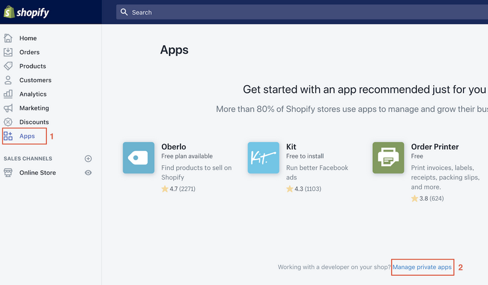
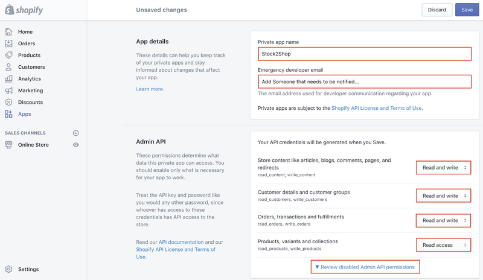
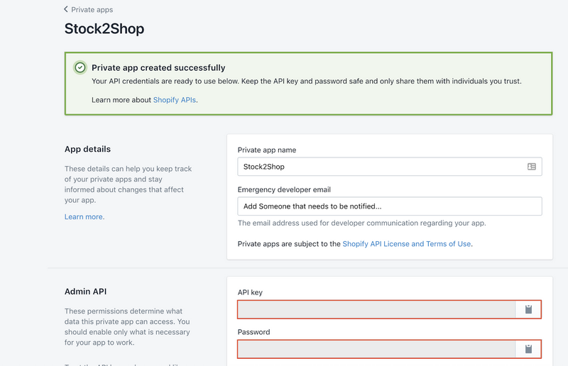

## Installing Stock2Shop for Shopify

### Contents

1. Introduction
2. Creating a private app

### Introduction

The steps below will guide you in creating a private application in Shopify. Stock2Shop requires all these settings to 
be configured prior to configuration. For technical information about the Shopify API visit 
[this page](https://shopify.dev/docs/admin-api/rest/reference).

### Creating a private app

Login to your Shopify store backend and navigate to select **Apps > Manage Private Apps**. Once you have navigated to 
**Manage Private Apps**, click **Create a new private app**.

Fill in the App details section as shown in the image below. Set all permissions to the highest possible, 
**Read and Write** being the highest or **Read access** if **Read and write** is not available on the individual 
dropdown.

Once you have completed filling out all the details and setting permission, be sure to **save** the app. A pop-up modal 
will appear asking to confirm you understand. Click **I understand, Create the app**. You will be directed to a page 
that will display the **API key** and **API Password**.

Send the **API Key** and **API Password** to your Stock2Shop Sale Representative who will capture these.

Any questions? Email support@stock2shop.com and we will happily help.