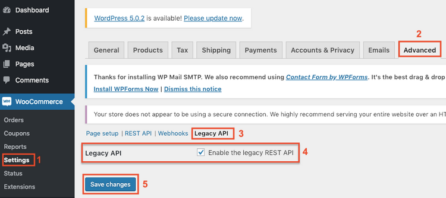
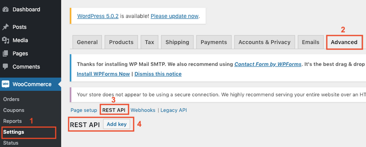
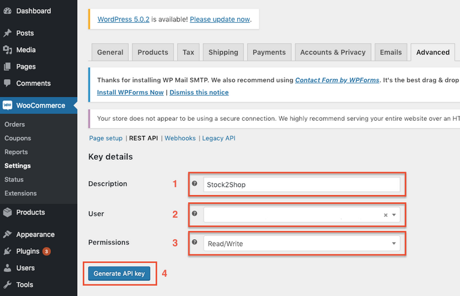
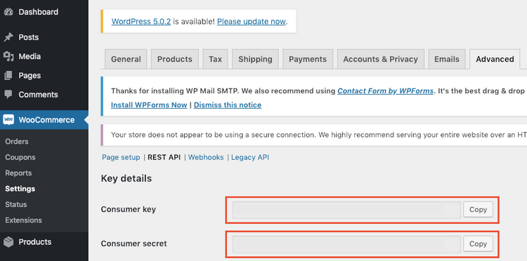
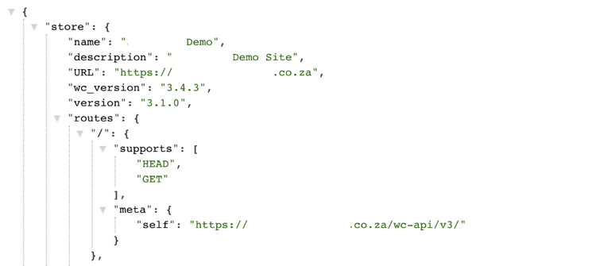
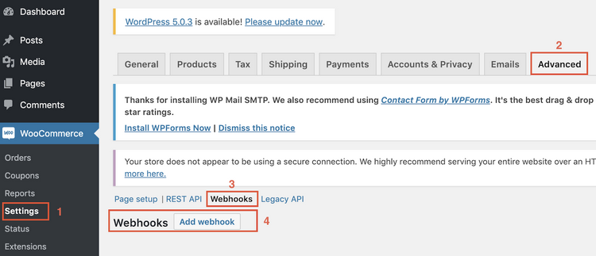
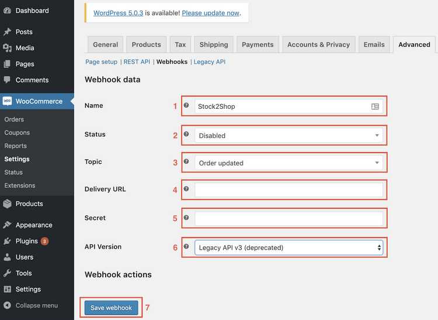

## Installing Stock2Shop for Woocomerce

1. Introduction
2. Requirements
3. Enable Legacy API
4. Create REST API key
5. Test your configuration
6. Set Up WooCommerce Webhook

### Introduction

Here you will find all the information you will need to prepare your WooCommerce website for integration.

Stock2Shop uses the standard WooCommerce API to send updates to your website, and a WooCommerce webhook to retrieve 
orders. In this section we will show you how to set up both your API and your webhook. Once this is done, you are ready 
to schedule your installation with Stock2Shop. Just follow these four easy steps:

 - Ensure your website meets the necessary technical requirements
 - Enable the WooCommerce Legacy API
 - Create the WooCommerce REST API keys
 - Set up a WooCommerce order webhook

### Requirements

or the integration between Stock2Shop and WooCommerce to work without any issues, you need to make sure you have the 
following:

 - WooCommerce 2.4+
 - WordPress 4.1+
 - Pretty permalinks is enabled. This you can find under Settings > Permalinks – make sure the “Post name” option is 
selected under “Common Settings”.
 - Valid SSL certificate – your site needs to run on HTTPS to allow Stock2Shop and WooCommerce to communicate securely

### Enable Legacy API

Navigate to **WooCommerce > Settings** and select **Advanced > Legacy API** Check the “**Enable the Legacy REST API**” 
box and save the changes.

### Create REST API key

Navigate to **WooCommerce > Settings** and select **Advanced > REST API > Add key**

In the **Description** field insert “Stock2Shop”. Make sure the **User** is one that will not be deleted over time as 
deleting this user will break the communication between Stock2Shop and WooCommerce. Set **Permissions** to “Read/Write” 
and click Generate **API key**

You will be directed to a page that will display the **Consumer key** and **Consumer secret**.

Send these keys to your Stock2Shop Sales Representative in a format that can be copy and pasted (ie not a screenshot).

### Test your configuration

Now that you have followed steps 1 through 4, it’s a good idea to check that you have done so correctly by testing your 
API. To do this, copy the following URL into your browser address (replace **yourwebsite.com** with your own domain) and
hit enter – **https://yourwebsite.com/wc-api/v3**

You should get a response similar to the one in the screengrab below.

### Set Up WooCommerce Webhook

You will need to add a webhook to WooCommerce to sync orders from WooCommerce to Stock2Shop, and on into your accounting system.

Navigate to **WooCommerce > Settings select Advanced > Webhooks > Add webhook**

Add in a **Name** of “Stock2Shop” and make the **Status** “Disabled” for the time being (this will be enabled when ready
to be tested) Set the **Topic** to “Order updated” from the dropdown and leave the **Delivery URL** “blank” Leave 
**Secret** “blank”and set the **API Version** to “Legacy API v3 (deprecated)” Click **Save webhook**

Any questions? Email support@stock2shop.com and we will happily help.